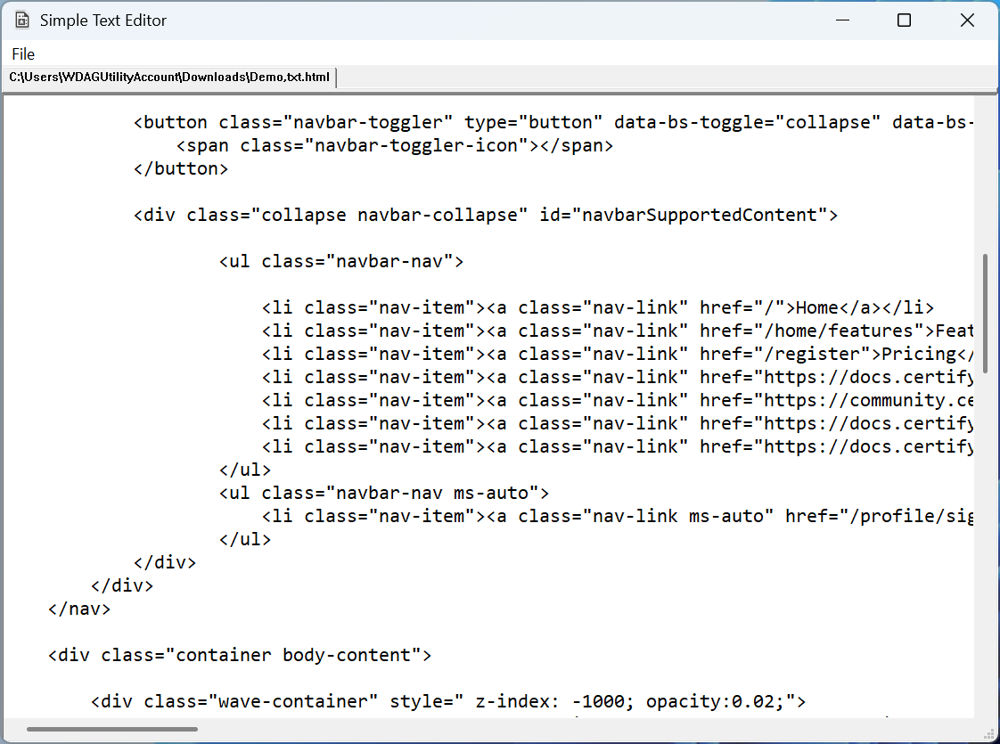

# Simple Text Editor

Sometimes you just need a tiny and quick text editor.

*Simple Text Editor* is a lightweight, Windows-native text editor built with C++ and the Win32 API. This editor provides essential text editing capabilities with a clean, tabbed interface.

## Features

### Core Functionality
- **Multi-tab Interface**: Open and work with multiple files simultaneously in separate tabs
- **File Operations**: Open, Save, and Save As functionality through the File menu
- **Drag & Drop Support**: Simply drag files from Windows Explorer into the editor to open them
- **Command Line Integration**: Open files directly from the command line or "Open With" context menu
- **UTF-8 Encoding**: Full support for UTF-8 text files

### Text Editing
- **Rich Text Editing**: Powered by Windows RichEdit control for advanced text handling
- **Large File Support**: No arbitrary text length limits - handles large files efficiently

### File Format Support
- Text files (*.txt)
- Log files (*.log) 
- JSON files (*.json)
- All file types (*.*) - universal text file support

## System Requirements

- Windows x64

## Installation

### Download Release
1. Go to the [Releases](../../releases) page
2. Download the latest `SimpleTextEditor-vX.X.X-windows-x64.zip`
3. Extract to your desired location
4. Run `SimpleTextEditor.exe`

### Build from Source
1. Clone this repository
2. Open `src/SimpleTextEditor.sln` in Visual Studio 2022 or later
3. Build in Release mode for x64 platform
4. Executable will be created in `src/x64/Release/`

## Usage

### Opening Files
- **File Menu**: Use File > Open to browse and select files
- **Drag & Drop**: Drag files from Windows Explorer directly into the editor
- **Command Line**: Right-click a text file and choose "Open With" → Simple Text Editor
- **Command Line**: Run `SimpleTextEditor.exe "path\to\file.txt"`

### Saving Files
- **Save**: Ctrl+S or File > Save (saves to current file)
- **Save As**: File > Save As (save with new name/location)

### Tab Management
- Each opened file gets its own tab
- Click tabs to switch between open files
- All tabs are automatically resized when the window is resized

## Technical Details

- **Language**: C++ with Win32 API
- **UI Framework**: Native Windows controls (RichEdit, Tab Control)
- **Build System**: Visual Studio project files
- **Architecture**: Windows x64

## Contributing

This is a simple, AI built, educational text editor project. Feel free to fork and modify for your own needs.

## License

See [LICENSE.md](LICENSE.md) for details.
